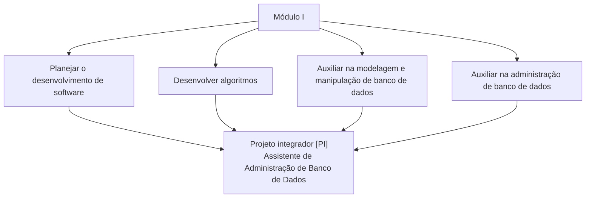
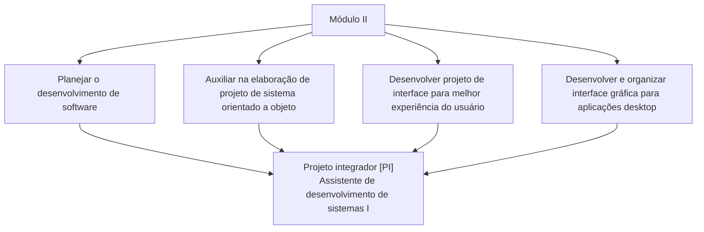
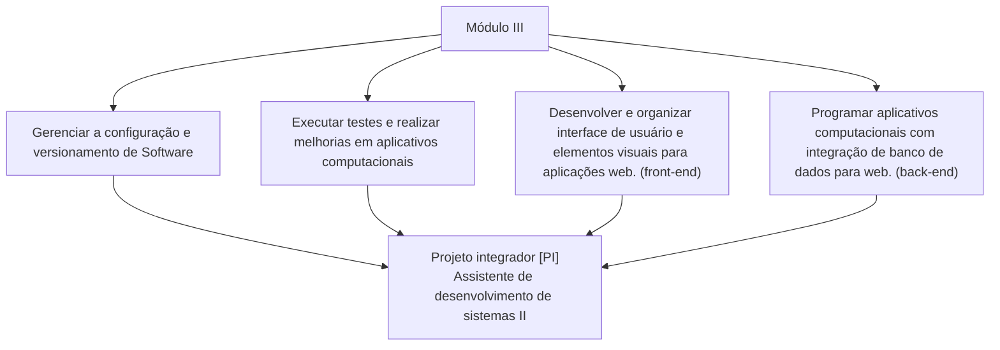

# Trajetória do curso

A linha do tempo a seguir representa a sua trajetória no curso.

Durante o seu curso Técnico em Desenvolvimento de Sistemas, você poderá verificar, a qualquer momento, as UCs (unidades curriculares) que já concluiu e as que ainda tem pela frente.

Nesta jornada, você precisa estar ciente de um elemento importante para a sua caminhada: o projeto integrador (PI).

Projeto integrador (PI)

    
O PI é uma UC diferenciada, pois exige o desenvolvimento de um projeto que é proposto conforme as características do curso. O PI estará presente do início ao fim do seu curso, a fim de estimular o desenvolvimento do seu perfil profissional.

O PI propõe desafios que estimulam o desenvolvimento de marcas profissionais diferenciadas, tais como:
- Atitude empreendedora, sustentável e colaborativa
- Visão sistêmica e crítica
- Domínio técnico-científico

O PI também possibilita que você pesquise a sua região e reflita sobre ela, para que você proponha soluções de acordo com as características locais e/ou regionais presentes.

Quanto às marcas profissionais, você pode obter mais informações sobre elas ao fim deste HTML.

## Marcas profissionais

O PI e as UCs possibilitarão que, ao longo do seu curso, você aplique conhecimentos profissionais em circunstâncias diversas de trabalho. Assim, você aprenderá a lidar com situações complexas, desafiadoras, problemáticas ou conflituosas.

Além disso, você será estimulado a desenvolver as marcas formativas do Senac. São elas:

- **Domínio técnico-científico:** Evidencia visão sistêmica, comportamento investigativo e foco no resultado final.

- **Atitude empreendedora:** Demostra criatividade, autonomia, dinamismo, iniciativa e inovação.

- **Visão crítica:** Realiza reflexões e contribui com críticas construtivas.

- **Atitude sustentável:** Promove a consciência sustentável, a responsabilidade social, a ética e a cidadania com respeito às diversidades.

- **Atitude colaborativa:** Trabalha em equipe com bom relacionamento interpessoal e comunicação.

*Em um mercado de trabalho cada vez mais competitivo, as marcas formativas fazem a diferença.*